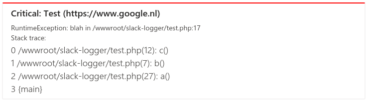

# NOTE: Sort of deprecated, but still usable!
Previous warning message from me: *Sending message to MS Teams using their Webhook API is being deprecated by microsoft so setting up "new connectors" this way isn't possible anymore.
For some projects we started switching to sending emails to teams channel because their new implementation is a pita to implement,
so hereby this package is not maintained anymore.*

However, Microsoft changed their mind because of lots of negative comments and the impact on killing connectors within a month,
so it's still possible for coming time to use this package (extended support, so far known till december 2025).
Which means I revived the package for usage, note however that you do need to update your webhook urls,
and you have to look somewhere else to find the connectors, see updated setup section below.

Note: I removed the abandoned status from composer, but keep in mind that it might be better,
if you have the time to look into different methods of logging to Microsoft Teams.

# Microsoft Teams Logger
Send errors/notices/warnings etc to Microsoft Teams,
using this Class which implements the Prs/Log/LoggerInterface.

For more information about the logger interface or log levels see [their github](https://github.com/php-fig/fig-standards/blob/master/accepted/PSR-3-logger-interface.md).

## Setup webhook
Before you can use this you need to setup a webhook in a Microsoft Teams channel.

1. Goto [https://teams.microsoft.com/](https://teams.microsoft.com/) and select a team.
2. Right mouse click on the desired channel and click "Manage Channel".
3. Goto tab "settings" and unfold "Connectors" and click "Edit".
4. Search for "Incoming Webhook" and click "configure".
5. Provide a name and image.
6. Click on "Create".
7. A new field will now appear with the new webhook url in it which you can copy-paste.

## Example
```php
<?php

$logger = new \Devorto\Logger\MicrosoftTeams(
	'<paste-webhook-url-here>',
	'My Test App',
	'https://test.example.com' // Optional app url.
);

// Use one of the available log level methods:
$logger->critical('Help something went critical.');

// You can also drop an Exception in here.
$logger->critical(new Exception('Test'));
```
Produces this in Microsoft Teams:

